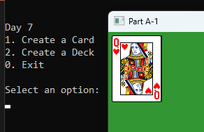
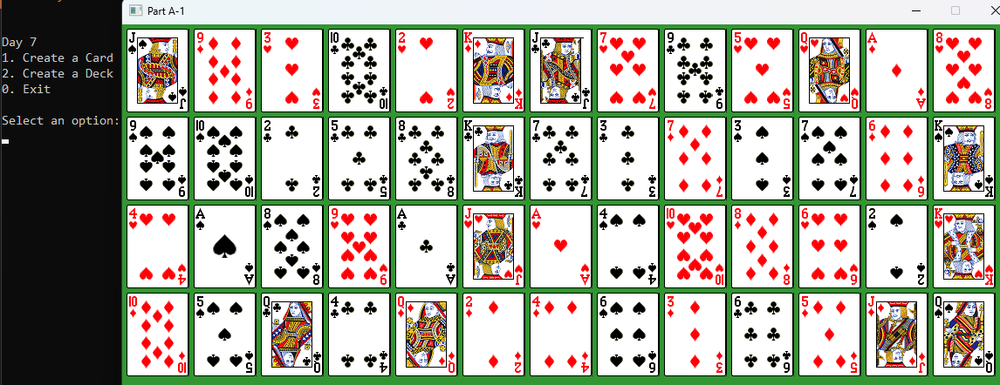

# 📘 Day 07 Lecture Practices

## 💻 Create a Class

### 🧩 Part A-1.1 Create a Card class
1. Right-click the Lectures project in the solution explorer and select "Add/Class..."
2. Enter `Card` as the name and press enter to create the class.

### 🧩 Part A-1.2 Fields with Getters and Setters
1. Add the following Fields to the Card class
   - suit and face. both should be strings.
   - `getters` and `setters` for the fields

### 🧩 Part A-1.3 Constructors
1. Add a `constructor` that takes 2 string parameters used to initialize the suit and face
     
### 🧩 Part A-1.4 Methods
1. Add the following methods...
   - a `Value` method. 
     - It should return an int
     - use the face to calculate a card value. A = 1, 2 = 2 ... J = 11, Q = 12, K = 13
   - a `Print` method
     - it should print the face " " suit. EX: `A Hearts`

### 🧩 Part A-1.5 Create a Card object
1. Open the `Day7.cpp`
2. Find the comment labeled `TODO: Part A-1.2 Create a Card object`. After the comment...
3. Create an instance of your Card class. You can use any face and suit.

### 🧩 Part A-1.6  call GameTextures::RenderImage
1. Open the `Day7.cpp`
2. Find the comment labeled `TODO: Part A-1.3  call GameTextures::RenderImage with the Card object`. After the comment...
3. call GameTextures::RenderImage method. pass the face and suit of your card object. Also pass the x, y, and scale variables.

#### 🎯 Result

---
## 💻 Create a Class 2

### 🧩 Part A-2.1 Create a Deck class
1. Right-click the Lectures project in the solution explorer and select "Add/Class..."
2. Enter `Deck` as the name and press enter to create the class.
3. Add the following items to the Deck class
   - Fields: vector of Card objects
   - getters and setters for the fields
   - a HasCards method. 
     - It should return bool. 
     - return true if the vector has Cards in it else return false.
   - a MakeCards method
     - it should create 52 cards.
     - internally, create 2 vectors of string. 
       - one should hold the faces ("A", "2", "3", etc).
       - one should hold the suits ("Hearts", "Clubs", "Diamonds", "Spades")
     - use nested loops to create 52 unique cards and add them to the vector for the class.
   - a DealCard method
     - it should return a card
     - In the definition...
       - it should check if the vector of cards is empty. If so, call the MakeCards method.
       - It should then get the last card in the vector of cards.
       - it should remove the last card in the vector of cards.
       - it should return the card.
     - a Shuffle method
       - In the definition...
         - it should check if the vector of cards is empty. If so, call the MakeCards method.
         - it should then randomly re-order the cards in the vector.

### 🧩 Part A-2.2 Create a Deck object
1. Open the `Day7.cpp`
2. Find the comment labeled `TODO: Part A-2.2 Create a Deck object`. After the comment...
3. Create an instance of your Deck class.
4. call the Shuffle method on your Deck object

### 🧩 Part A-2.3  call GameTextures::RenderImage
1. Open the `Day7.cpp`
2. Find the comment labeled `TODO: Part A-2.3  call GameTextures::RenderImage on each of the Card objects in the deck`. After the comment...
3. Loop while the deck object has cards. In the loop...
   - deal a card from the deck
   - call GameTextures::RenderImage method. pass the face and suit of your card object. Also pass the x, y, and scale variables.
   - keep track of how many cards have been shown.
     - if you've rendered 13 cards, 
       - reset x back to 5
       - increment y by cardSize.y + 5
       - reset the card count to 0
     - else increment x by cardSize.x + 5

#### 🎯 Result

## 🔭 Markdown Viewer

How to view the markdown files in a browser...
- [Markdown Viewer](../../Shared/0_Setup.md)

---

## 🧠 Lecture Practices

Here are the lecture Practices...
- [Day 7](./Day07.md)
- [Day 8](./Day08.md)
- [Day 9](./Day09.md)

---

## 🔍 Lecture Quizzes

Here are the lecture quizzes...
- [Day 7](https://forms.office.com/r/s02tg66qFm)
- [Day 8](https://forms.office.com/r/0bGwGBWENi)
- [Day 9](https://forms.office.com/r/Yc5p0bEgB8)

---

## Weekly Topics
Here are the topics for the week...
- [Classes](./1_Classes.md)
- [Structs](./1_Structs.md)
- [Fields](./2_Fields.md)
- [Getters and Setters](./2_GettersSetters.md)
- [Constructors](./3_Constructors.md)
- [Instances](./4_Instances.md)
- [Inheritance](./5_Inheritance.md)
- [Polymorphism](./6_Polymorphism.md)
- [Pointers](./7_Pointers.md)
- [Destructors](./9_Destructors.md)
- [Upcasting](./7_Upcasting.md)
- [Misc. Concepts](./8_Misc.md)
- [4 Pillars of OOP](./1_FourPillars.md)