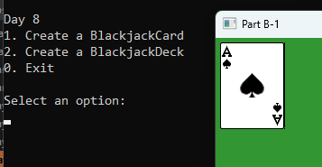
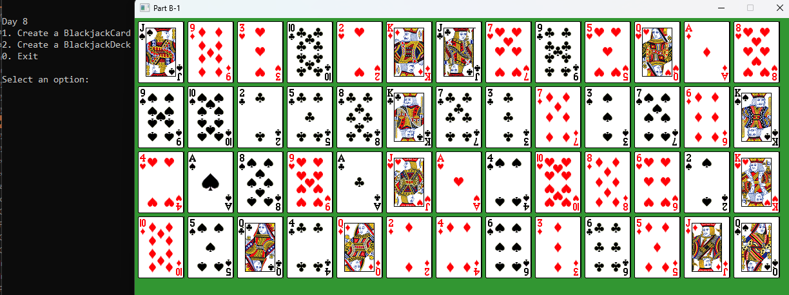

# 📘 Day 08 Lecture Practices

## 💻 Inheritance

### 🧩 Part B-1.1 Create a BlackjackCard class (Inheritance)
1. Right-click the Lectures project in the solution explorer and select "Add/Class..."
2. Enter `BlackjackCard` as the name and enter `Card` as the base class. Then press enter to create the class.
3. Add a `constructor` that takes 2 string parameters used to initialize the suit and face.
     - call the Card's constructor

### 🧩 Part B-1.2 Create a BlackjackCard object
1. Open the `Day8.cpp`
2. Find the comment labeled `TODO: Part B-1.2 Create a BlackjackCard object`. After the comment...
3. Create an instance of your BlackjackCard class. You can use any face and suit.

### 🧩 Part B-1.3  call GameTextures::RenderImage
1. Open the `Day8.cpp`
2. Find the comment labeled `TODO: Part B-1.3  call GameTextures::RenderImage with the BlackjackCard object`. After the comment...
3. call GameTextures::RenderImage method. pass the face and suit of your card object. Also pass the x, y, and scale variables.

## 💻 Polymorphism

### 🧩 Part B-1.4 Override (polymorphism)
1. `override` the Value method. 
     - It should return an int
     - use the face to calculate a card value. A = 1, 2 = 2 ... J = 10, Q = 10, K = 10
2. Open the `Day8.cpp`
3. Find the comment labeled `TODO: Part B-1.4 `. After the comment...
   - call the Print method of the card
   - call the Value method and print the value

#### 🎯 Result

---
## 💻 Inheritance and Polymorphism 2

### 🧩 Part B-2.1 Create a BlackjackDeck class
1. Right-click the Lectures project in the solution explorer and select "Add/Class..."
2. Enter `BlackjackDeck` as the name and press enter to create the class. Enter `Deck` as the base class.
3. Add the following items to the Deck class
   - override the MakeCards method
     - it should create 52 cards.
     - internally, create 2 vectors of string. 
       - one should hold the faces ("A", "2", "3", etc).
       - one should hold the suits ("Hearts", "Clubs", "Diamonds", "Spades")
     - use nested loops to create 52 unique `BlackjackCards` and add them to the vector for the class.

### 🧩 Part B-2.2 Create a BlackjackDeck object
1. Open the `Day8.cpp`
2. Find the comment labeled `TODO: Part B-2.2 Create a BlackjackDeck object`. After the comment...
3. Create an instance of your BlackjackDeck class.
4. call the Shuffle method on your BlackjackDeck object

### 🧩 Part B-2.3  call GameTextures::RenderImage
1. Open the `Day8.cpp`
2. Find the comment labeled `TODO: Part B-2.3  call GameTextures::RenderImage on each of the BlackjackCard objects in the deck`. After the comment...
3. Loop while the deck object has cards. In the loop...
   - deal a card from the deck
   - call GameTextures::RenderImage method. pass the face and suit of your card object. Also pass the x, y, and scale variables.
   - keep track of how many cards have been shown.
     - if you've rendered 13 cards, 
       - reset x back to 5
       - increment y by cardSize.y + 5
       - reset the card count to 0
     - else increment x by cardSize.x + 5

#### 🎯 Result

## 🔭 Markdown Viewer

How to view the markdown files in a browser...
- [Markdown Viewer](../../Shared/0_Setup.md)

---

## 🧠 Lecture Practices

Here are the lecture Practices...
- [Day 7](./Day07.md)
- [Day 8](./Day08.md)
- [Day 9](./Day09.md)

---

## 🔍 Lecture Quizzes

Here are the lecture quizzes...
- [Day 7](https://forms.office.com/r/s02tg66qFm)
- [Day 8](https://forms.office.com/r/0bGwGBWENi)
- [Day 9](https://forms.office.com/r/Yc5p0bEgB8)

---

## Weekly Topics
Here are the topics for the week...
- [Classes](./1_Classes.md)
- [Structs](./1_Structs.md)
- [Fields](./2_Fields.md)
- [Getters and Setters](./2_GettersSetters.md)
- [Constructors](./3_Constructors.md)
- [Instances](./4_Instances.md)
- [Inheritance](./5_Inheritance.md)
- [Polymorphism](./6_Polymorphism.md)
- [Pointers](./7_Pointers.md)
- [Destructors](./9_Destructors.md)
- [Upcasting](./7_Upcasting.md)
- [Misc. Concepts](./8_Misc.md)
- [4 Pillars of OOP](./1_FourPillars.md)