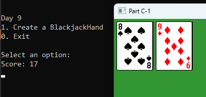

# 📘 Day 09 Lecture Practices

## 💻 Pointers

### 🧩 Part C-1 Modify Deck
We need to modify the existing Deck class to store pointers to Card objects.
1. Open the `Deck.h` file.
   - Change DealCard to return a Card*
   - Change the vector to hold Card*
   - add a virtual `destructor`
   - add a Cleanup method
2. Open the `Deck.cpp` file.
   - modify the DealCard definition to use Card* 
   - Add code for the destructor to call the Cleanup method
   - Add the definition for Cleanup.
     - loop over the vector of cards and delete each pointer.
     - clear the vector after the loop.
   - modify the definition of MakeCards to create Card pointers.
   
---

### 🧩 Part C-2 Modify BlackjackDeck
- Open the `BlackjackDeck.cpp` file
  - modify the definition of MakeCards to create BlackjackCard pointers.

  
---

### 🧩 Part C-3.1 Create a BlackjackHand class
1. Right-click the Lectures project in the solution explorer and select "Add/Class..."
2. Enter `BlackjackHand` as the name and press enter to create the class.
3. Add the following items to the BlackjackHand class
   - Fields: vector of pointers to Card objects, an int for the score
   - a getter for the score field
   - a getter for the Cards field.
   - a constructor that initializes the score to 0
   - a Clear method. 
     - reset the score to 0
     - loop over the vector of cards and delete each pointer.
     - clear the vector after the loop.
   - destructor that calls Clear
   - an AddCard method
     - it should 1 parameter: a pointer to a Card
     - add the card pointer to the vector.
     - update the score for the hand

### 🧩 Part C-3.2 Create BlackjackDeck and BlackjackHand objects
1. Open the `Day9.cpp`
2. Find the comment labeled `TODO: Part C-3.2 Create BlackjackDeck and BlackjackHand objects`. After the comment...
3. Create an instance of your BlackjackDeck class.
4. call the Shuffle method on your BlackjackDeck object
5. Create an instance of your BlackjackHand class
6. call DealCard twice on the deck. add each card to the BlackjackHand object using the AddCard method.

### 🧩 Part C-3.3  call GameTextures::RenderImage
1. Open the `Day9.cpp`
2. Find the comment labeled `TODO: Part C-3.3 call GameTextures::RenderImage on each of the Card objects in the hand`. After the comment...
3. Get the vector of cards from the BlackjackHand object.
3. Loop over the vector. In the loop...
   - call GameTextures::RenderImage method. pass the face and suit of your card object. Also pass the x, y, and scale variables.
   - keep track of how many cards have been shown.
     - if you've rendered 13 cards, 
       - reset x back to 5
       - increment y by cardSize.y + 5
       - reset the card count to 0
     - else increment x by cardSize.x + 5
   - after the loop, print to the console the current score of the BlackjackHand object

#### 🎯 Result

## 🔭 Markdown Viewer

How to view the markdown files in a browser...
- [Markdown Viewer](../../Shared/0_Setup.md)

---

## 🧠 Lecture Practices

Here are the lecture Practices...
- [Day 7](./Day07.md)
- [Day 8](./Day08.md)
- [Day 9](./Day09.md)

---

## 🔍 Lecture Quizzes

Here are the lecture quizzes...
- [Day 7](https://forms.office.com/r/s02tg66qFm)
- [Day 8](https://forms.office.com/r/0bGwGBWENi)
- [Day 9](https://forms.office.com/r/Yc5p0bEgB8)

---

## Weekly Topics
Here are the topics for the week...
- [Classes](./1_Classes.md)
- [Structs](./1_Structs.md)
- [Fields](./2_Fields.md)
- [Getters and Setters](./2_GettersSetters.md)
- [Constructors](./3_Constructors.md)
- [Instances](./4_Instances.md)
- [Inheritance](./5_Inheritance.md)
- [Polymorphism](./6_Polymorphism.md)
- [Pointers](./7_Pointers.md)
- [Destructors](./9_Destructors.md)
- [Upcasting](./7_Upcasting.md)
- [Misc. Concepts](./8_Misc.md)
- [4 Pillars of OOP](./1_FourPillars.md)