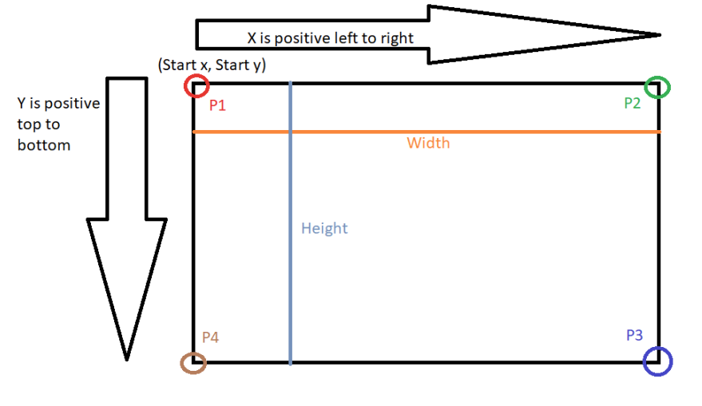

# ❓ Lab 3: Frequently Asked Questions
<!--TOC-->
  - [❓ Q: Do you have any tips for lab 3?](#-q-do-you-have-any-tips-for-lab-3)
  - [❓ Q: I get a build error saying access is denied to my graphics.exe file. What do I do?](#-q-i-get-a-build-error-saying-access-is-denied-to-my-graphics.exe-file.-what-do-i-do)
  - [❓ Q: I'm getting errors for the variable names I used in the .h file. Visual Studio says it's not a non-static data member or base class of class Pixel. What's wrong?](#-q-im-getting-errors-for-the-variable-names-i-used-in-the-.h-file.-visual-studio-says-its-not-a-non-static-data-member-or-base-class-of-class-pixel.-whats-wrong)
  - [❓ Q: How do I make a rectangle with a point and width and height?](#-q-how-do-i-make-a-rectangle-with-a-point-and-width-and-height)
  - [❓ Q: How do I get my rectangle to fit within the window?](#-q-how-do-i-get-my-rectangle-to-fit-within-the-window)
  - [❓ Q: How do I make my circle fit within the window?](#-q-how-do-i-make-my-circle-fit-within-the-window)
<!--/TOC-->
## ❓ Q: Do you have any tips for lab 3?

### 💡 A: Of course! here they are...

#### 📄 Pseudocode STILL Matters!
- Most issues with your line/circle are from not following the pseudocode.
- Only exception: you didn’t switch from terminal to console window.
- `endif` just ends the if statement in pseudocode.
- `while(true)` is totally valid.
- `if (condition) break;` means the break is the body.
   - You can rewrite it as `if (condition) { break; }` for clarity.

#### 🗝️ Access Modifiers (public/private/protected)
- Use them intentionally!
- Ask yourself: “Should other files see this?”
  - These are `core Programming concepts` — don’t ignore them.

#### 🏗️ Constructors & Initialization
Use member initialization! Example:
```cpp
MyClass(int a, int b) : m_a(a), m_b(b) {}
```

#### ❌ Don’t Include Your `.cpp` Files
- Including `.cpp` files = 50+ errors (circular inclusion nightmares).
- Only include `.h` files — when needed.
- Tip: If A.h includes B.h, and you include A.h in your file, you don’t need to include B.h again — it’s already included!

#### 🎨 Random Number in a Range
Use this pseudocode to help:
```cpp
int num = rand() % max + min;
```


## ❓ Q: I get a build error saying access is denied to my graphics.exe file. What do I do?

### 💡 A: There can be a few causes...
This can be caused by a few things.
- Visual Studio has the file locked.
- The debugger was unlinked from the graphics.exe program.
- Virus protection has locked the folder.

Here are several ways to fix the problem...
- Open the task manager and find graphics.exe. End the task.
- Restart Visual Studio.
- Restart your computer.


---

## ❓ Q: I'm getting errors for the variable names I used in the .h file. Visual Studio says it's not a non-static data member or base class of class Pixel. What's wrong?

### 💡 A: Do not name the getters/setters with the same name as your fields. 
Do not name the getters/setters with the same name as your fields. This will confuse the compiler.

Example of the problem...
```cpp
class BFG
{
private:
   int roundsPerSecond;
public:
   int roundsPerSecond() { return roundsPerSecond; }  
   BFG(int rounds);
};

in the cpp file...
//ERROR! the compiler won't know which to use here
BFG::BFG(int rounds) : roundsPerSecond(rounds)  
{  }

```

#### How to fix the example...
- use an appropriate naming convention for fields 
   - roundsPerSecond_ or mRoundsPerSecond or m_roundsPerSecond

---

## ❓ Q: How do I make a rectangle with a point and width and height?

### 💡 A: Combine the width and height with the start point
The rectangle needs a point2D which represents the top-left corner of the rectangle and a width and a height.

You would need to combine the top-left corner with the width and height to generate the 4 lines.

An easy way is to generate the other 3 points of the rectangle: top-right, bottom-right, and bottom-left.

Here's an example:
- If you pick a top-left corner at 75,35
- and your width = 10 and height = 15 then...
- top-right: (75 + 10), 35
- bottom-left: 75, (35 + 15)
- bottom-right: (75+10), (35 + 15)

> NOTE: the origin (0,0) is the top-left corner of the window. X values increase from left to right. Y values increase from top to bottom. See screenshot below.


 

---

## ❓ Q: How do I get my rectangle to fit within the window?

### 💡 A: The rectangle is constrained by the window's size
The rectangle needs a point2D which represents the top-left corner of the rectangle and a width and a height.

You would need to combine the top-left corner with the width and height to generate the 4 lines.

However, the top-left + the width or height needs to fit within the window. 

Here's an example:
- If the window size is 100,80
- and you pick a top-left corner at 75,35
- then the max width would be (100-75) = 25
- and the max height would be (80-35) = 45
- use those maxes with rand to get a random width and height that would fit in the window.

---

## ❓ Q: How do I make my circle fit within the window?

### 💡 A: The center point + radius cannot exceed the bounds of the window
You should pick a radius that will make the circle fit within the window. Here's an example:

- if the window size is 100,80
- and you pick a center pt at 5,77
- what would be the MAX radius?
- the MAX radius would be 3 (which is 80-77)


1. get your center
2. figure out the smallest possible MAX radius. That would be determined by the smallest distance the point is to the edges of the window.
3. use that MAX radius with rand

---
